
# 第4章 微电子IC封装技术

## 第4.1节 IC封装制程

### 概述

经典IC封装关键技术主要是：减薄研磨切割、芯片贴装、引线键合、 塑封。微电子封装关键技术主要是：叠层和置球（凸点）。

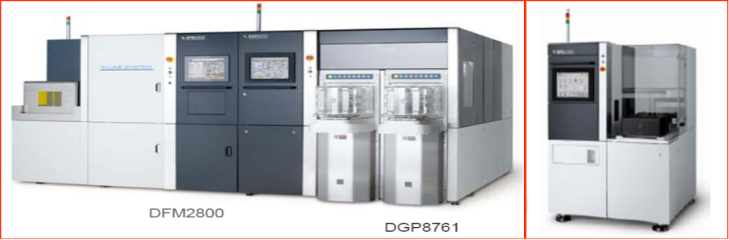

### 理论知识

#### 晶圆减薄划片

为了进一步降低生产成本，目前大批生产所用到的硅片多在6寸以上（如12寸、18寸），由于硅片尺寸较大，所以为了其不受到损害，厚度相应增加，这样就给切割以及划片带来了困难，所以在封装之前，一定要对硅片进行减薄处理。

先划片后减薄（Dicing Before Grinding, DBG）：在背面磨削之前将硅片的正面切割出一定深度的切口，然后再进行背面磨削，很好地避免或减少了减薄引起的硅片翘曲以及划片引起的芯片边沿损害。

减薄划片（Dicing By Thinning, DBT） ：在减薄之前先用机械的或化学的方式切割出切口，然后用磨削方法减薄到一定厚度以后，采用ADPE腐蚀去除掉剩余加工量，实现裸芯片的自动分离。各向同性的Si刻蚀剂不仅能去除硅片背面研磨损伤，而且能除去芯片引起的微裂和凹槽，大大增强了芯片的抗碎裂能力。

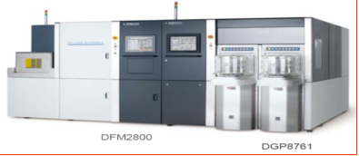

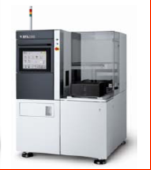

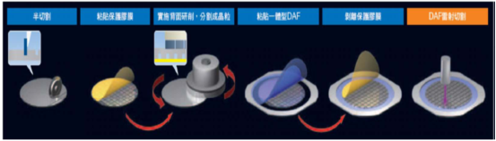

**1. 贴膜**

在封装之前，首先需贴膜（蓝膜），再对硅片进行减薄处理。

**2. 减薄**

**目前，硅片的减薄技术主要有:**

化学机械抛光（CMP）

干式抛光（Dry Polishing）

电化学腐蚀（Electrochemical Etching）

湿法腐蚀（Wet Etching）

等离子增强化学腐蚀（Plasma-Enhanced Chemical Etching,PECE）

常压等离子腐蚀（Atmosphere Downstream）。

化学机械抛光机是在抛光盘上覆盖一层抛光布，由马达带动旋转的压块可绕自身的中心线旋转，在抛光盘带动下使硅片相对抛光盘作行星式运动均匀。

抛光液是由二氧化硅(颗粒度大约是400-800A) 、氢氧化纳和水按一定比例组成，其中氢氧化纳起到化学腐蚀作用，使硅片表面生成硅酸纳盐，通过二氧化硅胶体，对硅片产生机械摩擦，随之又被抛光液带走。这样就实现了去除表面损伤面的抛光作用。化学腐蚀的快慢取决于PH值大小，一般配制的抛光液的PH值应控制在9―11之间。

在抛光时，要求化学腐蚀作用和机械削磨作用达到动态平衡。如果化学腐蚀作用大于机械磨削作用，则硅片表面被破坏，反之抛光速度又太慢，达不到生产要求。

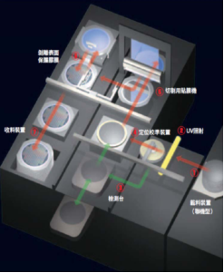

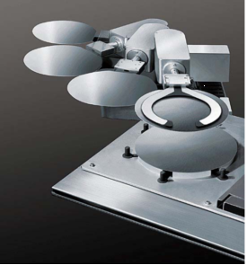

**抛光工艺参数**

| 参数 | 值 |
| --- | --- |
| 封装类型 | SOP12 -48，TBGA69-208，uBGA60 ，FBGA160-256 ，BGA208-492，LGA675 |
| 芯片尺寸xy mm | 2×2-24×24 |
| 圆片直径D mm | 5″(127mm)-24″(610mm) |
| 圆片厚度H mm | 1-3 |
| 厚度减薄h mm | 0.2-1 |
| 抛光转速转/min | 300 |
| 抛光压强kg/mm2 | 1-5 |
| 抛光时间min | 45-80 |
| 抛光液PH值 | 10-15 |

**3. 切割**

芯片切割是将硅片切成单个的芯片（Die），同时洗去硅片上的硅屑。

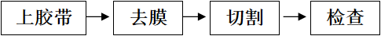

上胶带：在晶圆背面贴上胶带（Blue Tape），并置于钢制的框架上，此一动作叫晶圆黏片（Wafer Mount）；

去膜：切割前，去掉晶圆表面的保护膜。

切割：而后再送至芯片切割机上进行切割。切割完后，一颗颗之晶粒井然有序的排列在胶带上。

激光划片将雷射聚焦在工作物内部以产生变质层，再藉由扩展胶膜等方法将工作物分解成晶粒的切割方法。由于工作物内部变质，从而可以抑制加工碎屑的产生。

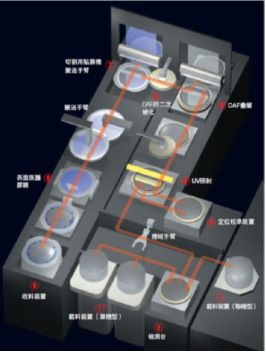

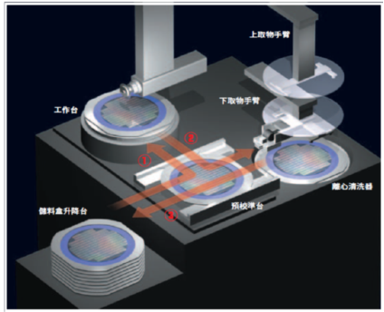

**切割工艺参数**

| 参数 | 值 |
| --- | --- |
| 封装类型 | SOP8-48，FC256-512 |
| 圆片直径D mm | 5″(127mm)-24″(610mm) |
| 圆片厚度H mm | 1.0-3.0 |
| 厚度减薄h mm | 0.2-1.0 |
| 芯片尺寸xy mm | 2×2-24×24 |
| 切割刀片转速rpm | 3000-40000rpm |
| 工作台X轴步距数 | D/x(取整) |
| 工作台Y轴步距数 | D/y(取整) |
| 切割高度 | H =H+0.1 mm |

**4. DPW计算**

一片晶圆可以切出多少芯片？抛去良率因素，这是一个简单的图形面积计算问题，它的专有的表征名词是“DPW”，DPW是Die Per Wafer的缩略词。晶圆可切割晶粒数(DPW)的计算是非常简单的。它的计算实际上是与圆周率π有密切的关联。

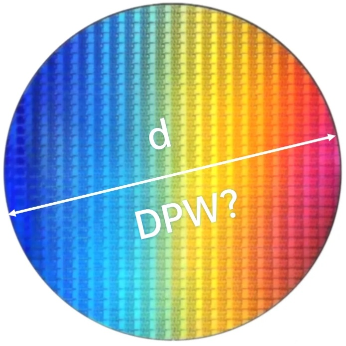

晶圆上的晶粒其实可以看作是圆形所能容纳下的所有方形的集合。所以，可切割晶粒数的计算就是利用圆周率和晶圆尺寸作为已知参数，确定出整体圆形区域能容量下的方形数量。

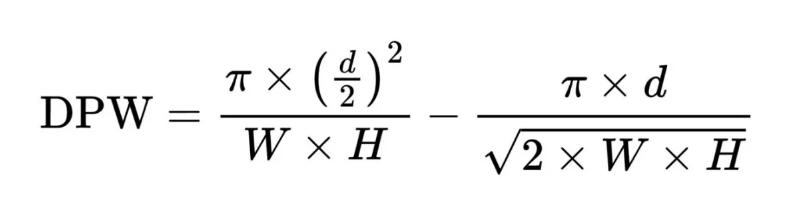

#### 封胶Mold

封胶（Mold）

芯片互连完成之后就到了塑料封装的步骤，即将芯片与引线框架“包装”起来。这种成型技术有金属封装、塑料封装、陶瓷封装等。塑料封装是最为常用的封装方它占据了90%的市场。塑料封装的成型技术有多种，包括转移成型技术（Transfer Molding）、喷射成型技术（Inject Molding）、预成型技术（Premolding）等，但最主要的成型技术是转移成型技术。

**1. 塑料封装**

转移成型技术使用的材料一般为热固性聚合物（Thermosetting Polymer）所谓热固化性聚合物是指低温时聚合物是塑性的或流动的，但将其加热到一定温度时，即发生所谓的交联反应（Cross-Linking），形成刚性固体。若继续将其加热，则聚合物只能变软而不能熔化、流动。

典型成型技术的工艺：将以贴装芯片完成引线键合的框架带置于模具中，将塑封的预成型块在预热炉中加热（预热温度在90-95℃之间），然后放进转移成型机的转移灌中。在转移成型活塞的压力下，塑封料被挤压到浇道中，并经过浇口注入模腔（在整个过程中，模具温度保持在170-175℃）。塑封料在模具中快速固化，经过一段时间的保压，使得模块达到一定硬度，然后用顶杆顶出模块，成型过程就完成了。封胶完成后的成品，可以看到在每一条导线架上的每一颗晶粒包覆着坚固之外壳，并伸出外引脚互相串联在一起。

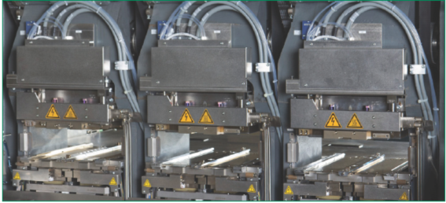

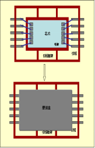

去飞边毛刺：有介质去飞边毛刺（Media Deflash）、溶剂去飞边毛刺（Solvent Deflash）、水去飞边毛刺（Water Deflash）。

**封胶工艺参数**

| 参数 | 值 |
| --- | --- |
| 封装类型 | SOP8-48 ，TBGA69-208，uBGA60，FBGA160-492，BGA208-492，LGA675 |
| 芯片尺寸xy mm | 2×2-24×24 |
| 塑封盒尺寸xy mm | 5.1×4-40×40 |
| 封胶形状 | 矩形 |
| 真空度par | 4-6 |
| 压力g | 550-700 |
| 焙烘温度/℃ | 150-200 |
| 封胶时间s | 110-160 |

**2. 金属管壳封装（平行封焊）**

平行封焊是最常用的气密性封装方法之一。可用于浅腔式、平底式、扁平式、双列直插式等各类金属管壳和各类陶瓷金属化管壳的封装。

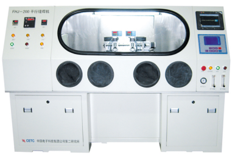

#### 引脚成形

封胶完后的导线架需先将导线架上多余的残胶去除（Deflash），并且经过电镀（Plating）以增加外引脚的导电性及抗氧化性，而后再进行剪切成型。

**1. 电镀（Solder Plating）**

对封装后框架外引脚的后处理可以是电镀（Solder Plating）或是浸锡（Solder Dipping）工艺，该工序是在框架引脚上做保护性镀层，以增加其可悍性。

电镀：目前都是在流水线式的电镀槽中进行的，包括首先进行的清洗，然后在不同尝试的电镀槽中进行电镀，最后冲洗、吹干，放入烘箱中烘干。

浸锡：首先也是清洗工艺，将预处理后元器件在助焊剂中浸泡，现浸入熔融铅锡合金镀层。工艺流程为：去飞边→去油→去氧化物→浸助焊剂→热浸锡→清洗→烘干。

凸点电镀：FC凸点下金属层（UBM）是通过电子束蒸发形成Ti和Cu层，再电镀铅锡合金层。

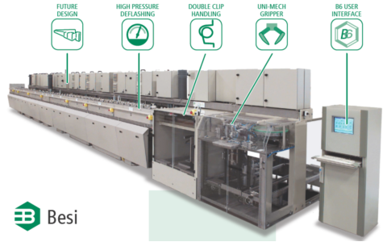

**2. 剪切成型（Trim/Form）**

剪切：目的是要将整条导线架上已封装好的晶粒独立分开，剪切完成时每个独立封胶晶粒的模样，是一块坚固的树脂硬壳并由侧面伸出许多支外引脚。

成型：的目的则是将这些外引脚压成各种预先设计好的形状，以便于尔后装置在电路板上使用，由于定位及动作的连器续性。

剪切及成型通常在一部机器上，或分成两部机（Trim/Dejunk , Form/Singular）上连续完成。成型后的每一颗IC便送入塑料管（Tube）或承载盘（Tray）以方便输送。

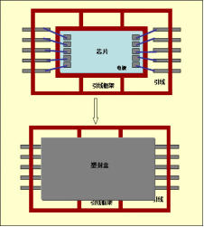

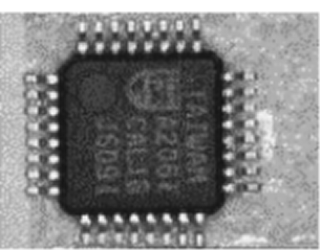

**3. 印字**

印字的目的，在注明商品规格及制造者。良好的印字令人有高尚产品感觉。

**印字的方式：**

**1）盖印式： 直接像印章一样印字在胶体上。**

**2）转印式（Pad Print）：使用转印头，从字模上沾印再印字在胶体上。**

**3）雷射刻印方式（Laser Mark）： 使用雷射直接在胶体上刻印。**

#### 芯片测试

在芯片完成这个封装流程之后，封装厂会对其产品进行质量和可靠性两方面的检测。

**1. 质量检测**

主要是检测封装后芯片的可用性，封装后的质量和性能情况；

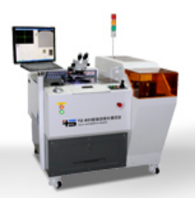

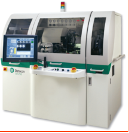

**2. 可靠性检测**

对封装的可靠性相关参数的测试。

**可靠性测试项目**

| 参数 | 值 |
| --- | --- |
| 测试项目 | 说明 |
| 温度循环测试T/C | 热胀冷缩的耐久性,反复1000次 |
| 热冲击T/S | 抗热冲击的能力测试 |
| 高温储藏HTST | 体长时间暴露在高温环境下的耐久性试验test |
| 温度和湿度T/H | 在高温潮湿环境下的耐久性试验 |
| 高压蒸煮PCT | 测试产品的电路通断性能 |
| 系统测试PPV | 测试产品的整体性能 |

## 第4.2节 引线贴装键合

### 概述

引线键合WB （Wire Bond）的是目前最常用的芯片电气互连技术，单个连接的成本最低、制作工艺灵活、适应性强，占领微电子互连方面约90%左右的市场。引线键合的是通过极细的线（18~50um）将晶粒上的电极与导线框架上的内引脚焊盘互连。

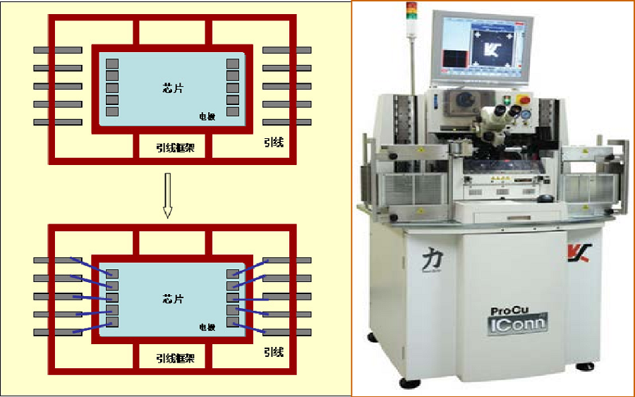

### 理论知识

#### 芯片贴装

芯片安装互连技术是IC的关键组装制造技术，IC芯片的安装(与引线框架或基板的物理连接)与互连(与引线框架或基板的电气连接)是两种相辅相成、密切难分的组装工艺过程。IC芯片的安装技术常见的有环氧粘接和共晶(或合金)粘接。互连技术常见的有：引线键合、载带自动键合和倒装焊接。面阵 型芯片（如BGA）键合可以通过焊料焊凸键合和倒装焊接进行；周边型芯片键合（如QFP）可以通过引线键合和载带自动键合技术进行。

芯片贴装（Die Bonding或Die Mount）也称为芯片粘贴，是将IC芯片固定于封装基板或引脚架芯片的承载座上的工艺过程。

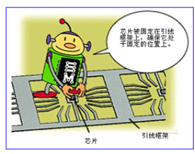

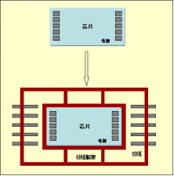

**1. 芯片贴装方法**

1) 胶固法：用胶水将IC芯片固定于封装引脚框架上，常用于键合工序前。

**2）共晶粘贴法： 利用金-硅合金（一般是69%Au,31%的Si），363℃时的共晶熔合反应使IC芯片粘贴固定。将硅芯片置于已镀金膜的陶瓷基板芯片座上，再加热至约425℃，借助金-硅共晶反应液面的移动使硅逐渐散至金中而形成的紧密接合。**

**3）焊接粘贴法： 将芯片背面淀积一定厚度的Au或Ni,同时在焊盘上淀积Au-Pd-Ag和Cu的金属层，将IC芯片固定于封装基板。**

**4）导电胶粘贴法：导电胶是填充银的具有良好导热导电性能的环氧树脂。导电胶粘贴法不要求芯片背面和基板具有金属化层，芯片粘贴后固化，成为塑料封装常用的芯片粘贴法。**

**2. 点胶机(器)**

点胶机将银胶或绝缘胶点入引线框架的碗杯中。芯片贴装(粘晶)机是将一颗颗分离的晶粒放置在导线架（Lead Frame）上并用银胶（Epoxy）粘着固定。

在金丝球焊机上手动固晶：在显微镜下，用固晶针笔将晶粒逐一划到支架碗杯的银胶上。固完一批后进行扶晶，使晶粒平稳立在碗中央。

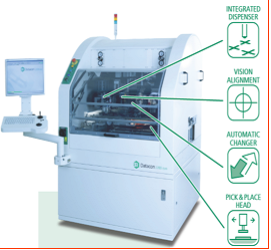

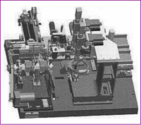

**3. 粘晶机**

芯片贴装的目的是将一颗颗分离的晶粒放置在导线架（Lead Frame）上并用银胶（Epoxy）黏着固定。导线架提供晶粒一个黏着的位置（晶粒座Die Pad），并预设有可延伸IC晶粒电路的延伸脚（分为内引脚及外引脚 Inner Lead/Outer Lead）。一个导线架上依不同的设计可以有数个晶粒座，这数个晶粒座通常排成一列，亦有成矩阵式的多列排法。

**工作过程：**

**1）点胶：导线架经传输至定位后，首先要在晶粒座预定黏着晶粒的位置上点上银胶（称为点胶）。**

**2）放置：然后移至下一位置将晶粒置放其上，晶粒则由取放臂一颗一颗地置放在已点胶之晶粒座上。**

**3）存放：黏晶完后，导线架则经由传输设备。**

**粘晶工艺参数**

| 参数 | 值 |
| --- | --- |
| 封装类型 | SOP8-48 ，TBGA69-208，uBGA60，FBGA160-492，BGA208-492，LGA675 |
| 芯片尺寸xy mm | 2×2-24×24 |
| 引脚间距mm | 0.5-1.27 |
| 基板框架 | 模制引线框架，高密度矩阵式引线框架 |
| 球直径mm | 0.35-0.86 |
| 点胶直径 | 0.5-5 |
| 点胶压力N | 2-6 |
| 点胶时间ms | 100-250 |
| 粘片压力N | 2-6 |
| 粘片时间ms | 300-450 |

LED粘片机是半导体发光二极管、三极管后工序生产线关键设备之一，是LED（发光二极管）生产过程中用于将管芯上电极与引线框架连接在一起的一种自动化设备。 首先，上料机构（移位器）会首先把引线框导入→点滴银浆→芯片成图像识别→拾取粘接机构从芯片处选取一个芯片，并贴合到焊位上→焊头机构焊接→继续移动到下一个焊位，直至此引线框全部杯口焊上芯片。

#### 引线键合

引线键合（Wire Bond）

引线键合技术是用金属丝将集成电路芯片上的电极引线与集成电路底座外引线连接在一起的过程。采用金属丝进行引线键合的原理是，当被焊的金丝或硅铝丝和焊接部位的金属化焊接面紧密接触时，通过劈刀施以一定的压力，再通过以瞬时低电压的大脉冲电流，使劈刀端头加热至所需的温度而实现引线和焊接面的局部发热，从而使接触部位的金属发生塑性变形，并破坏了接触界面的氧化层，达到两种金属接触到接近原子之间引力范围，使原子间互相扩散，促使两种金属表面产生弹性嵌合，这样就形成了金属引线与金属化焊接面的连接。

**1. 引线键合的类型**

引线键合通常采用热压、超声和热超声三种方法进行。

| 键合工艺 | 热压 | 超声波 | 热超声 |
| --- | --- | --- | --- |
| 键合压力 | 高 | 低 | 低 |
| 键合温度(℃) | 300~500 | 25 | 100~150 |
| 超声波能量 | 无 | 有 | 有 |
| 引线材料 | 金、Au | 金、Al、Au | 金、 Au |
| 焊盘材料 | Al、Au | Al、Au | Al、Au |
| 应用 | 常用 | 可焊铝线 | 可键合不能承受高温的器件 |

**2. 热压键合（Thermo-Compression）**

热压键合法的机制是低温扩散和塑性流动(Plastic Flow)的结合，使原子发生接触，导致固体扩散键合。承受压力的部位，在一定的时间、温度和压力的周期中，接触的表面就会发生塑性变形(Plastic Deformation)和扩散。塑性变形是破坏任何接触表面所必需的，这样才能使金属的表面之间融合。在键合中，焊丝的变形就是塑性流动。该方法主要用于金丝键合。

金丝球焊主要用于金丝键合，塑料封装的半导体集成电路制造，如SOP、QFP、LCC、PBGA等均采用金丝球焊工艺，它所用的设备是金丝球焊机。

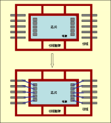

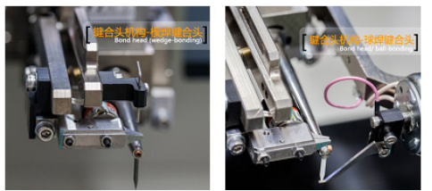

**3. 超声键合（Ultrasonic）**

超声键合是塑性流动与摩擦的结合。通过石英晶体或磁力控制，把摩擦的动作传送到一个金属传感器上。当石英晶体上通电时，金属传感器就会伸延；当断开电压时，传感器就会相应收缩。这些动作通过超声发生器发生，振幅一般在4～5μm。在传感器的末端装上焊具，当焊具随着传感器伸缩前后振动时，焊丝就在键合点上摩擦，通过由上而下的压力发生塑性变形。大部分塑性变形在键合点承受超声能后发生，压力所致的塑变只是极小的一部分，这是因为超声波在键合点上产生作用时，键合点的硬度就会变弱，使同样的压力产生较大的塑变。该方法可用金丝或铝丝键合。

楔焊主要用于金丝、铝丝、导体扁带等键合。微波器件、混合电路、直接板上组装、陶瓷封装、多芯片封装等，特别是大功率器件的封装均采用楔焊工艺。当第二键合点在芯片上方时，超声楔焊容易实现，球焊就很困难。超声楔焊工艺所用的设备是压焊机。

**4. 热超声键合（Thermo-sonic）**

热超声键合法是热压和超声键合两者的结合。它是通过对热量，焊接压力，超声功率以及焊接时间的科学控制来完成键合的。该方法主要用于金丝键合。

**键合机参数设置**

| 参数 | 值 |
| --- | --- |
| 焊线直径μm | 金线15~50，铝线 20~80 |
| 加热功率w | 4-6 |
| 压力g | 45-60 |
| 一焊时间s | 0.5-1.5 |
| 二焊的时间s | 1-2 |
| 成球大小 | 约焊线直径的2倍 |
| 焊接高度mm | 10-15 |
| 定机台加热板温度℃ | 200-250 |

**5. 铜线焊接**

铜具有很强的机械属性，相比于金和铝，铜的散热性更强，铜焊线线径更小，功率比却更高。因此，铜非常适合用于线焊技术。过去几年中，铜线焊接经历了几次跳跃，行业也不遗余力地从金线焊接向铜线焊接转换。

#### 倒装焊接

倒装焊接（Wire Bond）

倒装焊接是将芯片电极(凸点)面朝下放置，使芯片电极对准基板(矩阵框架)上的对应焊区，并通过加热、加压等方法使芯片电极或基板焊区上预先制作的凸点塌陷或熔融后将芯片电极与基板对应焊区牢固地互连焊接在一起，适用用WLCSP（FC）晶圆级封装转成BGA封装、FC/PoP/MCM等微组装。

芯片电极凸点与基板焊区或凸点间的互连，最常用的有以下两种方法：

① 再流焊。 先将芯片凸点与基板上相应焊区对准，再用粘结剂使芯片临时固定到基板上，最后将芯片与基板的共同体置入再流焊炉，使凸点焊料再流互连芯片电极和基板焊区。

② 倒装焊接机。 焊头吸附倒装芯片，在焊头与基板间有一面45°倾斜的半透镜，通过光学反射系统可在监视显示屏上同时看到透镜上下的两种图形，移动承片加工台使芯片凸点与基板焊区对准后，移开透镜，焊头携带芯片与基板焊区相触同时加压、加热，完成焊接。

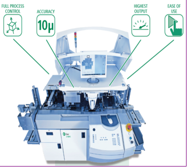

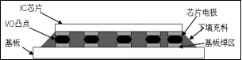

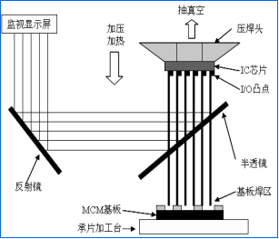

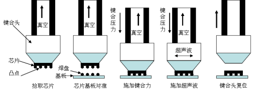

**倒装焊接机参数设置**

| 参数 | 值 |
| --- | --- |
| 芯片尺寸mm | 10×6-24×24 |
| 压焊头焊接时间ms | 250 -350 |
| 压焊头压力N | 4-8 |
| 压焊头焊接温度/℃ | 350-380 |
| 拾放头粘片时间ms | 400-600 |
| 拾放头粘片压力N | 4-8 |
| 基板框架 | PCB基板、陶瓷基板、LED玻璃基板模制引线框架、高密度矩阵式引线框架 |

底部填充:倒装焊接后一般要进行底部填充，把环氧树脂注入到芯片和基片之间，以保护焊接点，并通过固化炉固化环氧树脂，为芯片和基片之间的焊球提供结构化支撑。

#### 载带自动焊

载带自动焊TAB

载带自动焊TAB (Tpae Atmoatic Bnoding)是将IC芯片键合到各种组件基板上的一种焊接技术。这个组件包括单片和多片组件。把一定图形的载带引线导体焊接到芯片和组件上相应的I/0电极焊区便完成了这种键合。IC芯片功能面朝下的倒装TAB比面朝上的TAB组装密度更高、散热效果更好。

载带导线是在媒质载体上，既要完成与芯片I/0电极进行内部导线键合ILB (Inner Lead Bonding)连接，同时也要完成与基板或者其他芯片载体的外部导线键合OLB (Uter Lead Bnoding)连接。ILB和OLB可采用单点焊或载带焊接机组焊。单点焊是逐点加热、焊接，焊点精确但组装时间长。组焊是同时加热一条边或四周上的所有焊点后一次完成焊接，速度快，对设备精度要求高。

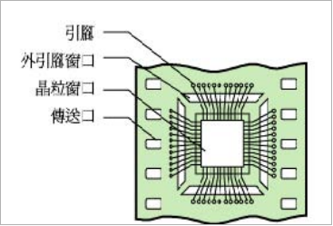

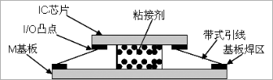

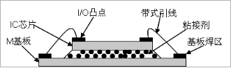

正装TAB倒装TAB

**1. 载带自动焊的类型**

载带自动焊有三种基本结构:传统式载带焊、倒装式载带焊以及凹型式载带焊。

**1）传统式载带焊。 是将芯片背面固定在基板或组件上，使得从芯片平面到基片或组件平面之间的导线键合十分容易，并具有很好的热传导能力。**

**2）倒装式载带焊。 是将可移动的芯片表面面对基片或组件，达到一种载带焊方式，其芯片表面的焊接间距与基片或组件上的间距是相等的，几乎不需要任何导线，结果使这种方法所需导线比传统式少，具有很小的引线电感。**

**3）凹型式载带焊。 类似于倒装式载带焊，其芯片焊接间距与组件上的间距相同只需很短的导线。倒装式载带焊和凹型式载带焊与传统式载带焊相比可提供更密集的载带焊组装。然而，由于材料和工艺的限制，凹型式载带焊难于实现。**

**4）阵列载带焊。 可以为导线提供固定在基片和组件上的阵列式键合结构。**

**2. 载带自动焊的工艺过程**

形成镀金的Cu引线框架→制作出凸点→内部导线键合(ILB)→形成梁式引线器件→外部导线键合(OLB)，完成带式引线与基板焊区间的电学连接。

**3. 内部导线键合ILB**

内部导线键合工艺是将内部TAB线头键合到IC芯片I/0电极上去的过程。ILB设备中主要有热超声单点键合机和恒温列式键合机。列式键合机主要用于导线数少、芯片小的场合，而单点键合机广泛用于导线数多、间距精密的场合。激光键合机己成为上述两种键合机的有生命力的替代物，但目前还只应用于锡载带。

① 列式ILB。 列式ILB的所有导线都同时需要一个很平整的热头，并在要求的键合区范围使焊接部位受热均匀。列式键合的加热头有两种：恒定热头和脉冲热头。前者被设置在特定的工艺温度下，而后者在键合工艺期间能按一定的分布曲线设置程序。恒定热头适用于热压键合，而脉冲热头更适用于低温共熔回流焊。两种方式要获得均匀的键合关键需要严格的温度控制和热头相对于键合平面的平整度。

② 单点键合。 一次键合一个线头到芯片焊头上可消除列式键合中的温度不均匀性和平整度问题，特别是对大面积芯片的键合。尽管热压、低温共熔、回流和激光等方法都被认为是单点键合的方法，然而最普遍的仍然是热超声键合。单点键合每个焊点的压力比热压方式的小，减少了对传统热头的要求，使修正未键合的导线成为可能，甚至可以直接采用铝丝键合。

**4. 外部导线键合OLB**

外部导线键合是指将载带上的铜箔引线与基板上的焊区互连起来。OLB可以在各种基板材料包括FR-4以及陶瓷上完成。

（1）OLB工艺流程

① 切割和引线成型。 在安装芯片以及进行外部导线键合之前，通常需要将键合IC的引线从TAB载带上切去并成型。引线成型的目的是将引线从ILB工序带至OLB工序并进行热应力释放。切割和成型是OLB工艺中关键的环节，并且随着引线尺寸和间距减少，其难度增大。

② 焊接处理和芯片粘接。 根据TAB的应用和焊接机理，在放置芯片之前需进行焊接处理和芯片粘接。焊剂用于引线焊接。从芯片安装工序转到粘接工序前，必须先将芯片粘接材料施于基板焊区表面。

③ 对位安装和焊接。 切割成型之后，部件被安放头取出对位安装。对位是可靠焊接的关键，需要精密机械和显示系统。器件放置完成后，便可用前述各种方法完成焊接。

④ 清洗。 焊接完成后要对焊区进行清洗处理以除去残留的焊剂。这一工序可以采用传统的表面贴装技术(SMT)中的清洗工艺。

（2）OLB焊接技术

外部导线键合可采用批量、单个元件的群焊和逐点焊接的方式来进行。

① 批量群焊。 是指红外再流焊或气相再流焊，用于焊区间距较大的器件。

② 单个元件群焊。 包括热压法、再流焊法、聚焦红外法。如同ILB，热压法利用热和压力，通常在金引线和金焊区之间、铜引线和铜焊区之间形成焊接。这种工艺的局限是对引线和基板的平整度要求以及杆头的平整度和热头温度控制要求比较严格。再流焊是目前流行的一种OLB工艺方法，它是用焊料进行焊接。聚焦红外法将红外线能量聚焦在焊区以完成焊接，控制对周围元件的影响是该技术要注意的问题。

③ 逐点焊接。包括热声法、热压法和激光法。如同ILB技术一样，热声逐点焊接法将热能和超声能结合起来完成焊接，通常需将基板和芯片加热到250℃左右。这种技术的优点是对平整度要求不严，并可返工。

## 第4.3节 微电子立体封装

### 概述

微电子封装技术就是把IC芯片(FC片)一片片叠合起来，利用芯片的侧面边缘或者平面分布，在垂直方向进行互连，将平面组装向垂直方向发展为立体封装。

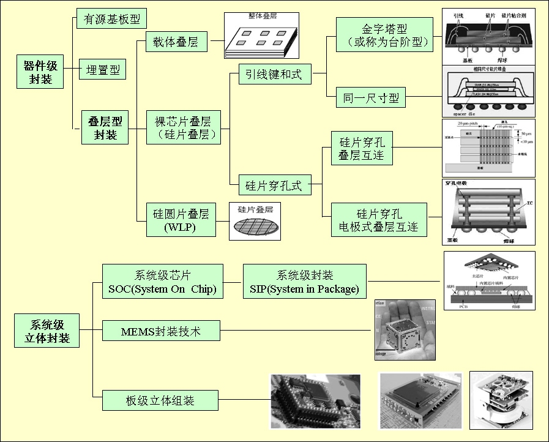

### 理论知识

#### WBLP引线式叠层封装

采用引线连接(WB) 、研磨剪薄等通用技术制作。将2个或2个以上裸芯片通过粘结，以电极面朝上的方式叠放在聚酰亚胺基板上，芯片电极分别与底部基板实现引线连接，通过基板的再布线，由基板底面球栅阵列布置的微球端子引出，最后由树脂模注成形完成封装。

金字塔型：在裸芯片之上搭载尺寸更小的裸芯片，形成台阶型的叠层结构；

同一尺寸：需要在两层芯片之间放置一层Spacer Die来垫高两层芯片之间的距离，使底部的芯片有足够的高度来进行引线键和。

典型应用：多是存储芯片，如SRAM、快闪存储器等。

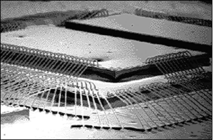

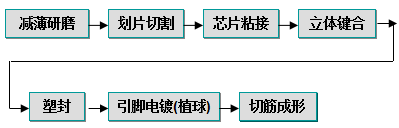

**1. 叠层型3D封装立体键合工艺**

1) 反向键合工艺

标准的正向键合工艺过程：首先把劈刀置于芯片上，以芯片键合区为第一焊点，引脚为第二焊点的顺序键合。反向键合工艺过程：则先把劈刀置于芯片键合区上，先打一个金球以后，再以引脚为第一焊点，芯片键合区为第二焊点的顺序键合，并把第二焊点打到金球上。

2) 芯片焊盘与引脚的Bump球金线键合

由于芯片键合区与引脚是两完全不同的材料，而在叠层芯片中不可避免地会有两芯片键合区之间的连接，这时就不是传统的键合模式可以完成了。在进行芯片与芯片间的连接时就必须使用Bump球模式。

Bump球模式的方法与上反向键合的方法差不多，即先在第二焊点打一个金球，然后再以正常键合模式把金线从第一焊点连接到第二焊点，这时的第二焊点上由于有了金球，因此在打第二焊点的参数设置上会比正常键合模式要小得多，这就是有效地保证了打第二焊点时对铝层下的芯片本身不会有太大的影响。

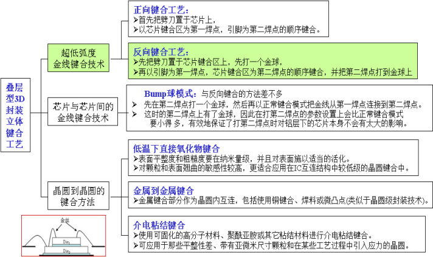

**2. 晶圆与晶圆的键合方法**

叠层型3D封装主要采用三种互连方法。

**1）低温下直接氧化物互连。 这种方法表面平整度和粗糙度要在纳米量级，并且对表面施以适当的活化。由于对颗粒和表面翘曲的敏感性较高，这种方法更适合应用在IC互连结构中较低级的芯片互连中。**

**2）金属到金属互连。其中金属键合部分作为芯片内互连，包括使用铜键合、焊料或微凸点，后一类方法还类似于晶圆级封装技术。**

**3）介电粘结互连。使用可固化的高分子材料、聚酰亚胺或其它粘结材料进行介电粘结互连。这种方法可以应用于那些平整性差、带有亚微米尺寸颗粒的芯片互连。**

#### TSV硅通孔叠层封装

硅片穿孔式是指在硅片穿孔后的通孔中填充金属，使之成为导电通孔，利用孔内的金属层以及金属焊点（通常是Cu）进行垂直方向的互连。 硅片微型通孔的孔径在微米量级，它进行电信号传输,有助于减小基片单面布线的复杂程度，提供良好的电气性能，提高阵列器件的排列密度。

最先的3D应用是CMOS图像传感器（CIS），接着是DRAM、存储器和异质集成。

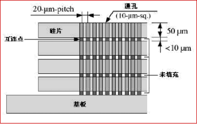

**1. 互连方式**

1) 导电通孔：硅片穿孔式是在硅片穿孔后的通孔中填充金属，使之成为导电通孔，利用孔内 的金属层以及金属焊点（通常是Cu）进行垂直方向的互连。利用硅片穿孔互连，把各种不同功能的硅片叠装在一块硅基板上，对外则形成适于表面贴装的BGA焊球，最终形成微系统。

**2）穿入通孔的电极：硅片打孔后，利用穿入通孔的电极进行互连，电极材料是通常也是铜。实现了成本低、高可靠性的互连。**

**2. 打孔方式**

通孔是在CMOS工艺开始之前或金属布线工艺过程中，在IC制造厂中实现的。

| 打孔方式 | 激光打孔法 | 湿法刻蚀法 | 反应离子刻蚀法DRIE | 电化学刻蚀法PAECE |
| --- | --- | --- | --- | --- |
| 最小孔径um | 12 | - | 20 | 4.4 |
| 深宽比 | 26 | - | 20 | 109 |
| 孔壁形状 | 垂直于硅片表面 | 孔壁于硅片表面 | 垂直于硅片表面成57.4度角 | 垂直于硅片表面 |
| 工艺兼容性 | 不兼容 | 兼容 | 兼容 | 不兼容 |
| 局限性 | 无局限 | 有晶向要求 | 无局限 | N 型硅片 |
| 加工成本 | 高 | 低 | 高 | 低 |
| 加工方式 | 串行 | 并行 | 并行 | 并行 |

**3. 键合技术：**

■ 氧化物（SiO2）共熔键合：键合温度1000℃。

■ 铜-铜共熔键合：需要到在350-400℃温度下施加压力超过30分钟；接着在350-400℃下的氮气气氛退火30-60分钟。

■ 共晶键合（Cu/Sn）：键合温度1000℃。■ 凸点技术（Pb/Sn、Au） ：键合温度1000℃。■ 高分子粘结键合：键合温度180℃。

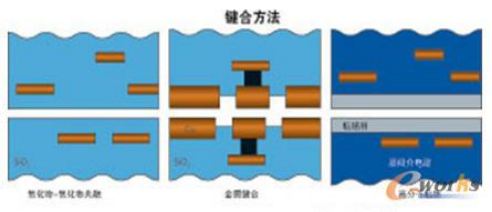

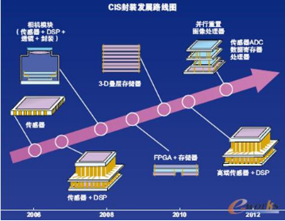

#### FC(WLCSP)晶圆级倒装片

晶圆级芯片封装(Wafer Level Chip Size Packing,简称WLCSP)就是芯片尺寸的封装，是对整片晶圆进行封装测试后再切割得到单个成品芯片的技术，封装后的芯片尺寸与裸片一致，而重新分配(redistribution)与凸点(bumping)技术为其I/O引线的关键技术。

1) 工艺工序大大优化，晶圆直接进入封装工序，封装测试一次完成，生产周期和成本下降。

2) 晶圆级芯片封装方法的最大特点是其封装尺寸小、IC到PCB之间的电感很小，信息传输路径短、稳定性高、散热性好。

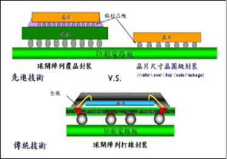

**1. 晶圆级芯片封装工艺**

WLCSP 与传统的封装方式不同在于，传统的晶片封装是先切割再封测，而封装后约比原晶片尺寸增加20%；而WL-CSP则是先在整片晶圆上进行封装和测试，然后才划线分割，因此，封装后的体积与IC裸芯片尺寸几乎相同，能大幅降低封装后的IC 尺寸。

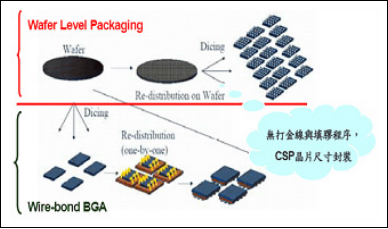

**2. 手机相机模块**

是封装起来的相机，包括: 传感器、镜头系统和影像处理芯片。相机模块有许多组装方式，而大多设计采用的是柔性和刚性基板相结合的方式。或金属布线工艺过程中，在IC制造厂中实现的。

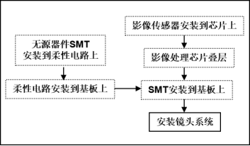

#### SOC和SIP系统级芯片封装

SOC/SIP系统级芯片/封装

**1. 系统级芯片SOC(System on Chip)**

SOC能够将各种功能集成在一个单一的芯片上面。 通常是将MPU、 DSP、图像处理、存储和逻辑推理器集成在一个40×40 mm或者更大的晶片上面；具有多达500至2000个焊盘，或者具有多达200～700个焊球的倒装芯片BGA器件。 但一些诸如SiGe, GaAs 和 CMOS 的工艺技术是互不兼容的，是不能用于系统级芯片之中的。

市场目标是高性能的系统，具有相当长的生命周期，面对的市场范围很大。

**2. 系统级封装SIP（System in Package）**

SIP在一个模块内提供一个完整的系统，形成一个功能性器件。 包括DSP+ SRAM+ 闪存 , ASIC+存储器 , 图像处理 + 存储器等.

通过不同方式进行整合,例如堆叠式晶片技术,或将各种晶片整合到同一基板上, 甚或将晶片嵌入基板等，具有其独特的优势；统级封装很容易将CMOS、 GaAs 或者SiGe等互不兼容的半导体技术融合在一个单元内，从而达到高功能和性能。

市场目标是无线通信、PDA装置和消费类产品，面对的市场范围相对较窄，产品的生命周期较小。

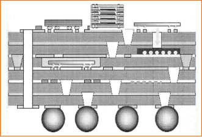

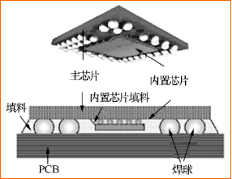

**3. 晶粒软膜构装COF（Chip on Film）**

晶粒软膜构装技术COF（Chip on Film）是将芯片被直接安装在柔性PCB上。这种连接方式的集成度较高，外围元件可以与IC一起安装在柔性PCB上。

1) 各种构装技术的比较： 不论是在于挠折性、厚度、与面板接合的区域，都远优于其它技术。且主要IC及周边组件亦可直接打在软模上，可节省PCB的空间及厚度，也可以节省此用料之成本。

2) COF的结构组成： COF的结构类似于单层板的FPC，皆为一层基膜再加上一层的铜，两者的差异在于接合处的胶质材料，再加上两者皆须再上一层绝缘层，故两者的结构至少就差了两层的胶。

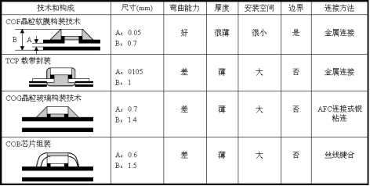

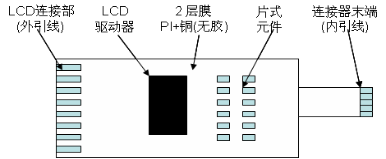

#### MEMS微电子机械系统

微电子机械系统MEMS(Micro-Electro-Mechanical-System) 不但具有信号处理能力, 而且具有对外部世界的感知功能和执行功能。特征尺寸至微米/纳米级、具有将感受量转换为电信号的器件和系统。

1) 传感MEMS：速度、加速度、压力、温度、湿度、气体、磁、光、声、生物、化学等；

2) 生物微反应器MEMS：微流体腔和微流体管道；

3) 执行MEMS：硬盘读写头、喷墨打印头、数字微镜阵列（DMD）、光开关、RF开关、微电机等。

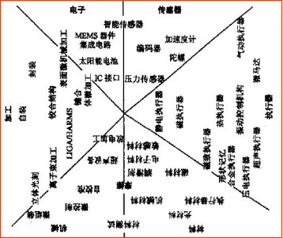

MEMS产品设计：系统、器件、电路和封装等设计。

MEMS材料：单晶硅和多晶硅，压电材料和合成材料。

MEMS的关键部件：微型传感器（Micro-sensor），微型执行器(Micro- actuator)和微型系统（Micro-system）。

MEMS工艺：硅基加工（IC制造）和非硅基加工（微机械加工）。

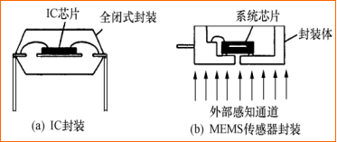

**1. MEMS制作工艺**

从机械加工角度来看，MEMS制作工艺分为硅基加工和非硅基加工，是从IC芯片电路工艺基础上发展出来，集成电路工艺重点在“薄膜”图形制作和掺杂，而MEMS制作工艺重点在“硅体”制作和分离。MEMS微机械加工工艺主要包括：体加工工艺、硅表面微机械加工技术、结合加工、逐次加工。

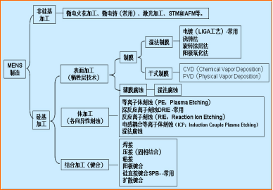

**2. LIGA技术**

LI(Lithographier)深度X射线刻蚀；G(Galvanformug)电铸成型；A(Abformug)塑料铸膜。

| 项目 | LIGA | 准LIGA |
| --- | --- | --- |
| 刻蚀 | 深度X射线刻蚀：在数百微米后的PMMA光刻胶上刻蚀出较大深宽比的光刻胶图形，高宽比一般达到100。 | 紫外光光刻 |
| 电铸 | 利用光刻胶层下面的金属膜作为电极进行电镀，将显影后的光刻胶所形成的三维立体结构间隙用金属填充，直到光刻胶上面完全覆盖了金属为止，形成一个与光刻图形互补稳定的相反结构图形。 |  |
| 塑铸 | 采用子母模的办法 |  |

MEMS的“机械部分（运动或传感）在硅衬底上先沉积上一层最后要被腐蚀（牺牲）掉的膜（如SiO2），再在其上淀积制造运动机构的膜（如多晶硅、氮化硅等） ，然后用光刻技术制造出机构图形和腐蚀下面膜的通道，最后进行牺牲层腐蚀而使微机构自由释放出来，呈现可运动的机构。

微动结构的腐蚀一般采用深反应离子刻蚀DRIE， DRIE采用氯和氟为基础的等离子体（如用射频功率驱动）刻蚀出近似垂直壁面的深层结构。目前已经能刻蚀出200μm的深度。

---

# 第5章 IC器件封装工艺设计

## 第5.1节 IC封装类型

### 概述

集成电路IC封装工艺的类型和方法多， 经典IC封装类型主要有：SOP、PLCC 、QFP ， 微电子封装类型主要有： BGA 、 WBLP、TSV、FC (WLCSP) 、SIP、 MEMS等。集成电路器件封装种类繁多，不同类型或不同性能要求， 工艺方法和设备也不同。根据封装类型、圆片尺寸、封装尺寸、外引脚数等进行设计。

### 理论知识

#### PTH封装

绝大多数PTH（Pin Through Hole）封装集成电路相邻两个引脚的间距是2.54mm（英制100mil）；DIP(Dual In line Package)封装芯片两列引脚之间的距离是7.62mm（300mil）或15.24mm（600mil）。集成电路的表面一般都有引脚计数起始标志，在DIP封装集成电路上，有一个圆形凹坑或弧形凹口。

#### SMD封装

表面安装器件SMD的I/O电极有两种形式：无引脚和有引脚。无引脚形式有陶瓷芯片载体封装（LCCC），占主导地位的引脚形状有翼形、钩形和球形三种。图a、b、c分别是翼形、钩形和球形引脚示意图。翼形引脚用于SOT/SOP/QFP封装，钩形引脚用于SOJ/PLCC封装，球形引脚用于BGA/CSP/Flip Chip封装。还有过一种引脚形状叫对接引脚，如图d所示。

#### BGA阵列封装

BGA是大规模集成电路的一种极富生命力的封装方法。通常BGA的安装高度低，引脚间距大，引脚的共面性好，这些都极大的改善了组装的工艺性。由于它的引脚更短，组装密度更高，特别适合在高频电路中使用。

#### 微电子封装

微电子封装技术呈现出日新月异、百花盛开、争奇斗艳的良好局面. 微电子封装技术的基础是集成电路IC封装技术，重点发展方向是三维立体封装技术和微机电子封装技术。

## 第5.2节 SOP/BGA表贴封装

### 概述

SOP（QFP）和BGA表贴封装是目前集成电路器件封装的主流，是电子产品的主芯片。

### 理论知识

#### SOP封装工艺

**1. SOP封装工艺流程**

| SOP工艺流程 |  |  |  |  |
| --- | --- | --- | --- | --- |
| 序号 | 工序选择 | 设备选择 | 说明 | 图示 |
| 1 | 1.贴膜 | A1.贴膜机 | 背面研磨保护 |  |
| 2 | 2.背面研磨 | A2.抛光机 | 减薄 |  |
| 3 | 3.切割 | B2.机械切割机 | 将晶圆上晶粒(Die)切割分离 |  |
| 4 | 5.粘贴芯片到引线框架 | C2.粘晶机 | 将芯片(Die)固定在引脚架上 |  |
| 5 | 6.键合 | D1.金丝球焊机 | 用金线或铝线将晶粒焊盘连接到导脚架的内引脚 |  |
| 6 | 7.探针测试 | L2.探针测试机 | 测试通断 |  |
| 7 | 8.封胶 | E.封胶机 | 将芯片与引线框架“包装”起来 |  |
| 8 | 9.切筋 | I.切筋成形机 | 将芯片与导脚架分开 |  |
| 9 | 10.引线电镀 | F.引线电镀机 | 芯片引脚电镀铅锡 |  |
| 10 | I3.成形 | I.切筋成形机 | 芯片引脚成形 |  |
| 11 | 12.印字 | H.激光印字机 | 印规格 |  |
| 12 | 15.老化测试 | L3.老化测试机 | 终测 |  |
| 13 | 14.测试分选包装 | L1.测试分选机 | 按性能分选，并包装成盘装Tray或管装Tube |  |

**2. SOP封装工艺参数**

| SOP封装结构尺寸 |  |  |  |  |  |  |  |  |
| --- | --- | --- | --- | --- | --- | --- | --- | --- |
| 圆片直径D mm | 5″(127mm) | 8″(203mm) | 12″(305mm) |  | 18″(457mm) |  |  | 24″(610mm) |
| 圆片厚度H mm | 1 | 1.5 | 2.0 |  | 2.5 |  |  | 3 |
| 封装类型 | SOP8 | SOP12 | SOP18 | SOP24 | SOP28 | SOP32 | SOP40 | SOP48 |
| 芯片尺寸xy mm | 2×2 | 3×3 | 4×4 | 6×4 | 8×6 | 10×6 | 12×8 | 14×10 |
| 塑封盒尺寸xy mm | 5.1×4 | 8.7×4 | 18×7.5 | 18×7.5 | 18.5×8.3 | 20×8.3 | 18.8×10 | 18.4×12.4 |
| 引脚间距mm | 1.27 | 1.27 | 1.27 | 1.27 | 1.27 | 1.27 | 0.8 | 0.5 |
| 基板框架 | 模制引线框架 |  |  |  |  |  |  |  |
| 框架尺寸xy mm | 20×10 | 24×10 | 34×13 | 34×13 | 34×14 | 36×14 | 34×16 | 34×18 |
| 引线总长mm | 25 |  |  |  |  |  |  |  |

#### BGA封装工艺

**1. BGA封装工艺流程**

**2. BGA封装工艺参数**

| 序号 | 项目 | BGA封装结构尺寸 |  |  |  |  |  |  |  |
| --- | --- | --- | --- | --- | --- | --- | --- | --- | --- |
| 1 | 封装类型 | BGA208 | BGA492 | FBGA160 | FBGA256 | TBGA69 | TBGA208 | uBGA60 | LGA675 |
| 2 | 圆片直径Dmm | 8″(203mm) |  | 12″(305mm) |  | 18″(457mm) |  |  | 24″(610mm) |
| 3 | 圆片厚度H | 1.5 |  | 2 |  | 2.5 |  |  | 3 |
| 4 | 芯片尺寸xy | 12×12 | 24×24 | 8×8 | 12×12 | 4×4 | 8×8 | 8×4 | 24×24 |
| 5 | 塑封盒尺寸xymm | 28×28 | 40×40 | 22×22 | 28×28 | 18×18 | 22×22 | 22×18 | 40×40 |
| 6 | BGA球间距 | 1.27 | 1.27 | 1 | 1 | 1 | 0.65 | 0.5 | 0.5 |
| 7 | BGA球直径 | 0.76 | 0.76 | 0.35 | 0.5 | 0.45 | 0.45 | 0.35 | 0.86 |
| 8 | 基板框架 | 高密度矩阵式引线框架 |  |  |  |  |  |  |  |
| 9 | 框架尺寸xy | 38×38 | 50×50 | 32×32 | 38×38 | 28×28 | 32×32 | 32×28 | 50×50 |

## 第5.3节 器件叠层封装

### 概述

WBLP引线式叠层封装和TSV硅通孔叠层封装是典型的微电子器件级立体封装，己广泛应用于手机贮存和照相机。

### 理论知识

#### WBLP引线式叠层封装工艺

**1. WBLP封装工艺流程**

**2. WBLP封装工艺参数**

#### TSV硅通孔叠层封装工艺

**1. TSV封装工艺流程**

**2. TSV封装工艺参数**

## 第5.4节 晶圆级封装

### 概述

晶圆级芯片封装(Wafer Level Chip Size Packing,简称WLCSP)就是芯片尺寸的封装，是对整片晶圆进行封装测试后再切割得到单个成品芯片的技术，封装后的芯片尺寸与裸片一致，尺寸小，工艺工序大大优化。重新分配(redistribution)与凸点(bumping)技术为其I/O引线的关键技术。凸点(bumping)技术是器件封装与板级组装的高度融合的核心技术。

### 理论知识

#### WLCSP晶圆级封装工艺

**1. WLCSP封装工艺流程**

**2. WLCSP封装工艺参数**

## 第5.5节 系统级封装

### 概述

系统级封装SIP（System in Package）在一个模块内提供一个完整的系统，形成一个功能性器件。包括DSP+ SRAM+闪存,ASIC+存储器,图像处理+存储器等。

### 理论知识

#### SIP系统级封装工艺

**1. SIP封装工艺流程**

**2. SIP封装工艺参数**

---

# 第6章 集成电路封装工厂

## 第6.1节 IC封装实验工厂

### 概述

IC封装实验VR虚拟工厂的设备主要是半自动化操作和人工上料。实验VR虚拟工厂生产操作是按照IC封装类型的工艺流程，先漫游找到工艺流程的某个设备，再完成所选择的设备的操作，设备操作包括：开机、上料、生产模拟运行、取料和关机等，同时观察产品结构变化。

### 理论知识

#### IC封装实验工厂

**1. 工厂设备**

减薄车间：贴膜机、激光切割机、机械切割机、化学机械抛光机；

贴焊车间：粘晶机、点胶器、金丝球焊机、超声楔焊机、粘贴倒装焊接机、直接铜键合机；

芯片车间：电子束蒸发机、光刻系统、等离子去胶机、凸点电镀机；

测试车间：探针测试机、测试分选包装机、老化测试机；

包装车间：封胶机、激光印字机、切筋成形机、引线电镀机；

置球车间：置球机、激光植球机、压铜机、回流焊；

**2. 工厂模拟运行**

IC封装实验VR虚拟工厂的设备主要是半自动化操作和人工上料。

**1）漫游：按照IC封装类型（SOP和BGA）的工艺流程，先漫游找到工艺流程的某个设备；**

**2）设备操作：包括开机、上料、生产模拟运行、取料和关机等，**

**3）同时观察该设备进出料窗口，观看产品结构变化。**

| BGA封装VR虚拟工厂操作 |  |  |  |
| --- | --- | --- | --- |
| 序号 | 工艺流程 | 设备选择 | 操作步骤 |
| 1 | 1.贴膜 | A1.贴膜机 | 漫游到设备A1 |
| 上料模型（BGA-M0b） |  |  |  |
| 贴膜机动作 |  |  |  |
| 出料模型（BGA-M1b） |  |  |  |
| 2 | 2.背面研磨 | A2.抛光机 | 漫游到设备A2 |
| 上料(BGA-M0b)交互动画U2.4.1 |  |  |  |
| 抛光动作 |  |  |  |
| 面板使用 |  |  |  |
| 出料(BGA-M2b) |  |  |  |
| 3 | 3.切割 | B2.机械切割机 | 漫游到设备B2 |
| 上料模型（BGA-M0b） |  |  |  |
| 机械切割机动作 |  |  |  |
| 出料模型（BGA-M3b） |  |  |  |
| 4 | 5-1.粘贴芯片 | C2.粘晶机 | 漫游到设备C2 |
| 上引线框架作 |  |  |  |
| 点胶 |  |  |  |
| 拾取 |  |  |  |
| 视觉对中 |  |  |  |
| 贴放 |  |  |  |
| 下引线框架 |  |  |  |
| 出料（BGA-M4b） |  |  |  |
| 5 | 6-1.键合 | D1.金丝球焊机 | 漫游到设备D1 |
| 装引线框架 |  |  |  |
| 装金线 |  |  |  |
| 烧金球 |  |  |  |
| 第一点焊接 |  |  |  |
| 第二点焊接 |  |  |  |
| 复位 |  |  |  |
| 出料（BGA-M5b） |  |  |  |
| 6 | 7.探针测试 | L2.探针测试机 | 漫游到设备L2 |
| 上料模型（BGA-M5b） |  |  |  |
| 出料模型（BGA-M5b） |  |  |  |
| …. |  |  |  |

## 第6.2节 IC封装生产工厂

### 概述

生产VR虚拟工厂的设备主要是自动化操作和自动上料。生产VR虚拟工厂生产操作：是按照封装工艺流程和生产节拍，先漫游找到封装工艺流程的几台同类设备中的一台，再完成所选择的设备的操作，设备操作包括：开机、上料、生产模拟运行、取料和关机等，同时观察产品结构变化。生产VR虚拟工厂生产物流：是按照生产节拍、产量和封装工艺流程，先漫游找到该节拍同时工作的N个不同类设备，观察不同类设备运行后产品结构变化和物流传输。

### 理论知识

#### IC封装生产工厂

**1. 工厂设备**

封装生产VR虚拟工厂的设备主要是自动化操作和自动上料，采用AGV小车传输。不同于IC实验工厂，封装生产VR虚拟工厂的设备均有N台同类设备，保证完成产能。

**2. 产能计算**

单台键合机单节拍的设计产量A= 20晶粒

同批次键合机同时加工数量B=40台

18″圆片可分割晶粒数量 C=80个

圆片/框架车（AGV）数 D= 1台（10台）

单生产周期(1天)批次数量 E=15

圆片/框架车装盒数量 F= 1盒10圆片（）4盒80框架）

年产量G=12月×25天×E×B ×A = 360万

**3. 日周转节拍**

节拍1：1台设备工作

节拍2：2台设备同时工作

节拍8后：8台设备同时工作，同类设备会重叠工作

**4. 封装生产工厂生产操作**

IC生产工厂生产操作的设备主要是自动化操作和自动上料。

**1）漫游：按照封装工艺流程和生产节拍，先漫游找到封装工艺流程的几台同类设备中的一台；**

**2）设备操作：包括开机、上料、生产模拟运行、取料和关机等，**

**3）同时观察该设备进出料窗口，观看产品结构变化。**

**5. 封装生产工厂生产物流**

**1）漫游：是按照生产节拍、产量和封装工艺流程，先漫游找到符合封装工艺流程的某节拍的设备和该节拍后7个节拍的7个不同类的同时工作的设备；**

**2）物流：观察不同类设备运行后产品结构变化和物流传输。**
